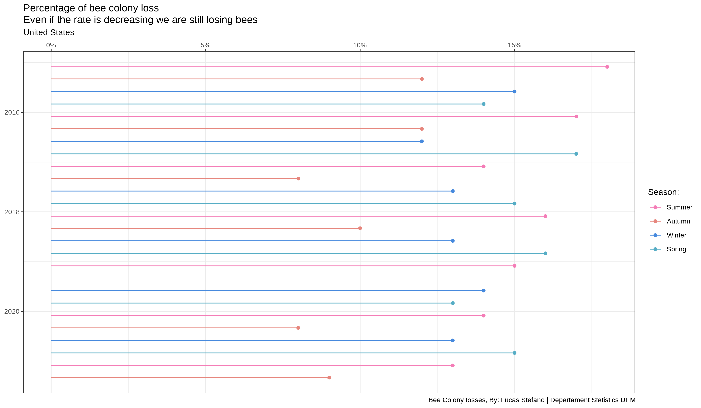

```{r setup, include=FALSE}
knitr::opts_chunk$set(echo = TRUE)
```


#### `2022-01-11`

| Data | Source | Article |
|------|--------|---------|
| [Bee Colony Iosses](https://github.com/rfordatascience/tidytuesday/blob/master/data/2022/2022-01-11/readme.md) | [USDA](https://usda.library.cornell.edu/concern/publications/rn301137d?locale=en) | [Bee Informed](https://beeinformed.org/2021/06/21/united-states-honey-bee-colony-losses-2020-2021-preliminary-results/) |


